# Trace

**An iOS training partner for bouldering.** Film a climb and Trace tells you one thing
to fix, with the moment marked on your own video. Photograph a wall and it reads the
routes off it by color and draws a line through the one you pick.

*Listed on the App Store as Trace Climbing, because the bare name is taken there by
unrelated apps. The home screen reads Trace.*

<p align="center">
  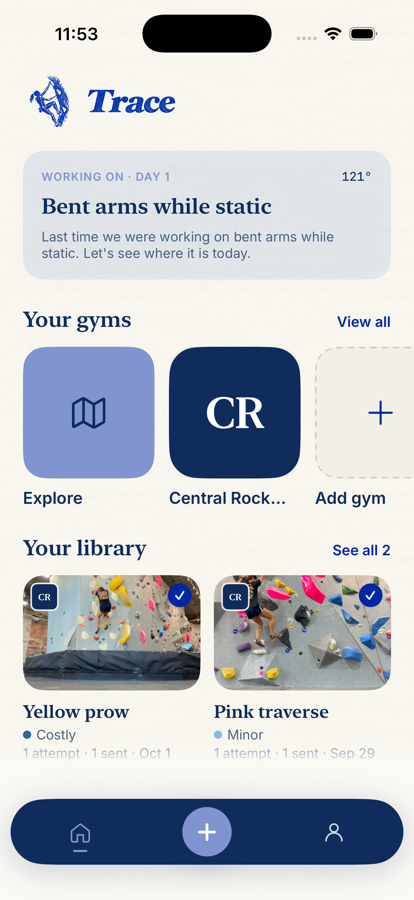
  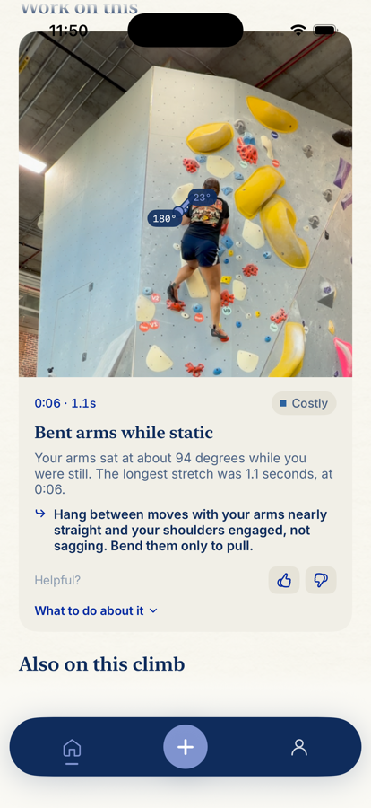
  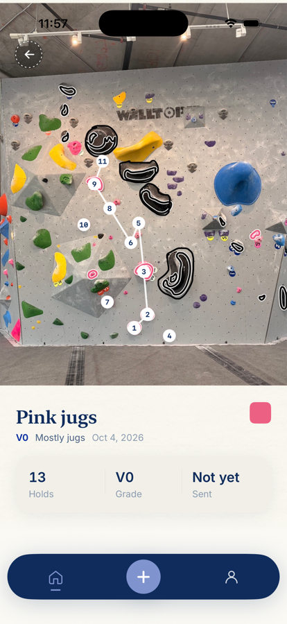
</p>

### [Try it in your browser &rarr;](https://k-12345-1.github.io/trace/)

Trace is a native iOS app, so a browser cannot run the Swift. The link above is the
analysis ported to JavaScript: give it a climbing video and a pose model in the page
tracks you, then the same arithmetic on the same thresholds produces the same
findings. Tap a hold on a photo of a wall and it reads the route off it by color.
Nothing you load there leaves your device.

Every picture below is the real iOS app, captured from the running build. To use that,
clone the repository and press Run in Xcode.

---

## It watches you climb

Apple's Vision body-pose model gives fifteen joints per frame. Everything Trace says
is arithmetic on that time series. Nothing is uploaded, and no model is trained.

<p align="center">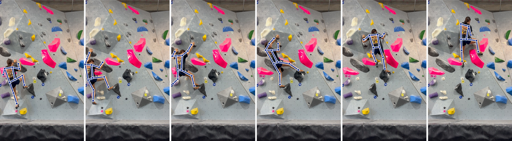</p>

Six moments from one of the clips in `Climbing AppTests/Fixtures`, with the skeleton
Trace tracked drawn over them. The analysis runs on the phone, in a few seconds.

<table>
<tr>
<td width="46%">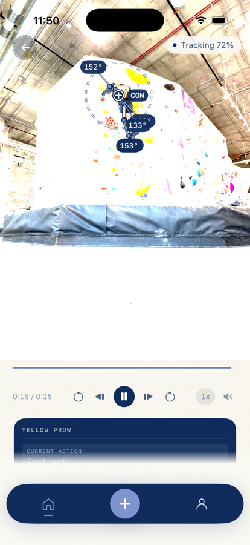</td>
<td width="54%">

**On the footage.** The skeleton, the center of mass, and the elbow angles as they
change, scrubbable frame by frame at quarter speed.

A clip Trace could not see clearly enough is told so rather than coached: below 55
percent tracking confidence it draws nothing and says nothing. Confidently wrong
coaching is the failure mode that kills this product.

**One thing to work on.** Each finding names what was measured, freezes the frame it
happened on, marks the joints it is about, and gives the correction in one sentence.
Worst first, and that is the card in the middle of the three above.

Thresholds come from real climbing rather than synthetic fixtures. On five tracked
clips a resting arm reads about 150 degrees in the picture, because an arm reaching
to the wall is foreshortened from in front, so "bent arms" starts at 135 and stops
firing on every clean climb.

</td>
</tr>
</table>

### What it measures

| Metric | What it is |
|---|---|
| Geometric entropy | `ln(2L / C)` over the center-of-mass path and its convex hull. The established climbing-specific efficiency measure. Lower is smoother. |
| Log dimensionless jerk | Third derivative of COM position, normalized by duration and path length. Lower is more continuous. |
| Path ratio | COM path length over straight-line distance. |
| Static elbow angle | Mean elbow angle while the COM is near-still. |
| Weight on arms | How far the COM sits sideways of the feet, in torso lengths, while resting. |
| Deadpoint timing | Gap between a hand arriving on a new hold and the apex of the COM arc. |
| Hips on the reach | Where the hips sat against the other hand as a reach across set off, and whether they came toward the hold while the arm went. |
| Pauses and foot resets | Hesitation, and placements that had to be corrected. |

A moving camera is detected separately, by registering consecutive frames. When
somebody followed you up the wall, Trace takes the phone's movement back out of the
skeleton before measuring, shows the moments, and withholds the whole-climb scores,
because over a climb the registration's small errors accumulate.

---

## It reads a wall

<p align="center">
  
  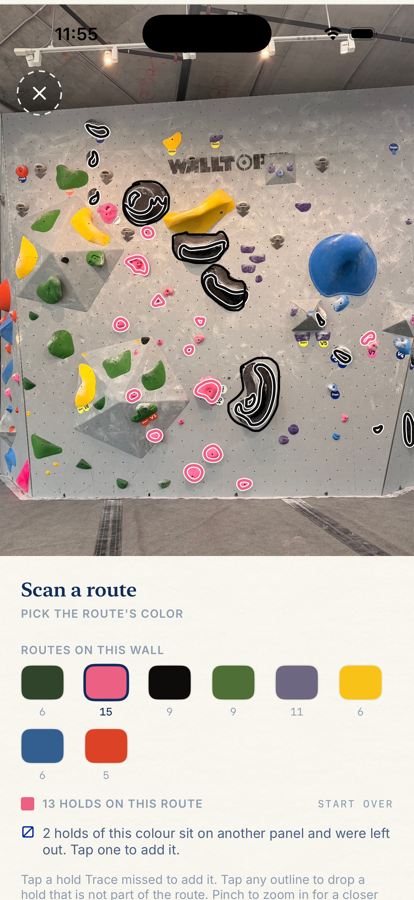
  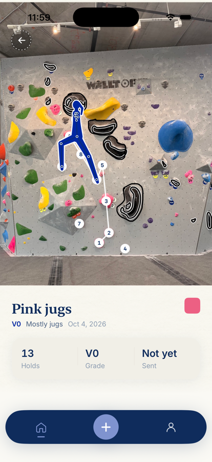
</p>

Photograph a wall. Every blob within a CIE Lab color distance is picked out, chalk
on a hold is adopted as part of it, and the routes are offered as a palette: tap a
color to see that route alone. Start and finish stickers and the V-grade are read
with Vision text recognition. No trained model and no route database, so it works on
the first photo in any gym.

It cannot tell a route apart from unrelated holds of the same color, which is why
you drop the wrong ones before saving. Two routes set in one color are told apart by
their stickers.

### And draws a line through it

<p align="center">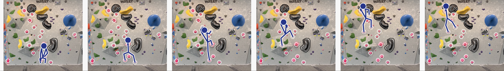</p>

One shape through the line, found by a search over where four limbs can be: both
hands start on the start holds and finish on the finish hold, a foot never goes below
the mat, and the figure stands the way climbers stand. That last part is measured,
not guessed. Eight clips of real bouldering were tracked and reduced to the
proportions of a resting stance, and a test holds the planner's medians inside the
climbers' quartiles over every route the scanner finds on six photographed walls.

Trace cannot see hold types, the wall's angle, or which way a hold faces, so this is
the line rather than the beta, and the app says so on the screen.

---

## The rest of the app

<p align="center">
  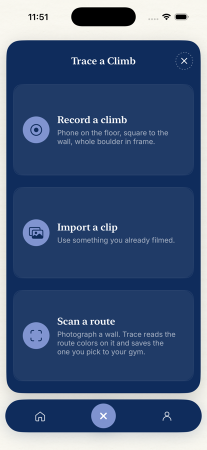
  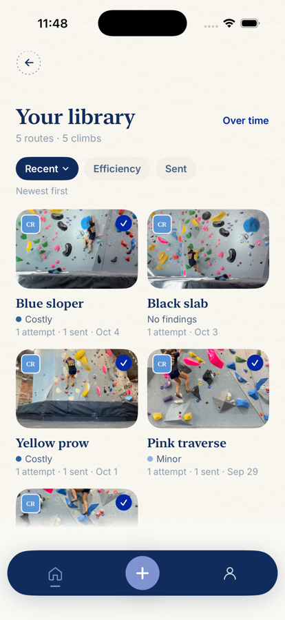
  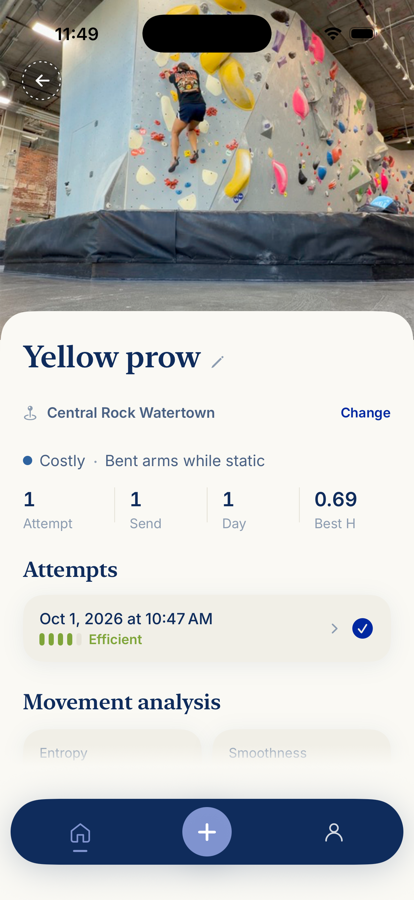
</p>

Climbs are grouped by label, so attempts at the same problem are compared against
each other and against your own history rather than against a number. The home screen
carries one thing you are working on, picked from what keeps coming up.

---

## Running it

```bash
open "Climbing App/Climbing App.xcodeproj"
```

Pick the **Climbing App** scheme, then cmd-R to run or cmd-U to test. Run on a device
for the camera: the simulator has no real one, so use **Import a clip** and **Choose
from library** there.

From the command line:

```bash
xcodebuild test -project "Climbing App/Climbing App.xcodeproj" -scheme "Climbing App" \
  -sdk iphonesimulator -destination 'platform=iOS Simulator,name=iPhone 17 Pro'
```

497 tests in 109 suites. Most are known-answer, every expected value coming from the
geometry or the color maths; the rest run the engines over six photographed walls
and five tracked climbs kept as fixtures.

**Signing in.** Trace asks for an account. Until the server issues them, a demo pair
signs in locally with no request made: email `trace@climb.co`, password `ClimbOn!`.
Debug builds only.

## Layout

```
Climbing App/
  Climbing App.xcodeproj
  Climbing App/
    Analysis/    pose tracking, metrics, findings, focus, clustering, route scanner
    Models/      climb, pose, focus, gym, route
    Capture/     AVFoundation capture and guided framing
    Views/       SwiftUI screens, the video overlay, scanning and gyms
    Storage/     local JSON persistence
    Design/      the visual identity as tokens
    Fonts/       Inter Regular, Medium, SemiBold, Bold (SIL OFL)
  Climbing AppTests/
    Fixtures/    six photographed walls, six tracked climbs, one video clip
docs/            the pictures on this page
identity.html    the published visual identity
```

The Xcode target is **Climbing App** and the product module is `ClimbingApp`. The
product is branded **Trace**, which is what the bundle display name and the interface
both say.

## Status

The analysis path has been run end to end on real climbing footage, which is the
question the project lives or dies on. It holds a skeleton on a body pressed against
a wall and facing away. Trace's own tracking confidence on the five clips reads
100, 100, 95, 72 and 41 percent; the weakest falls below the 55 percent floor and is
correctly declined rather than coached.

**The capture path has never executed on real hardware.** The simulator has no
camera, so recording in the app is the one flow that has only ever been read, not
run.

One number is picked by judgement rather than derived:
`BetaClustering.sameSequenceThreshold`. It wants calibrating against real footage.
